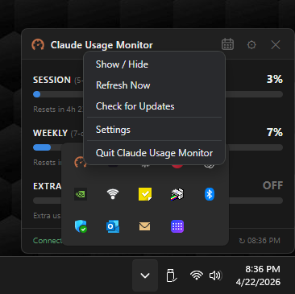
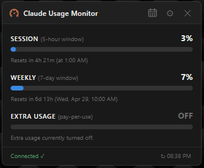
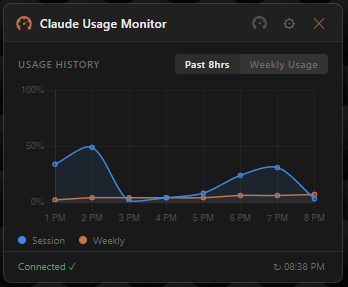
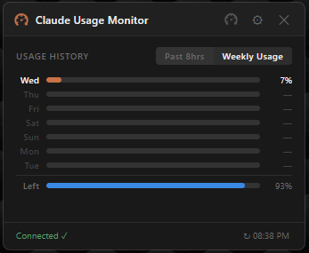
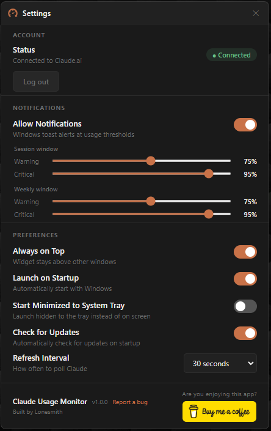

# Claude Usage Monitor

Never get caught off guard by Claude's usage limits again.

A Windows desktop widget that monitors your Claude.ai session and weekly 
usage limits in real-time. Sits in the system tray — always available, 
never in the way.

## Download

**[⬇ Download Claude Usage Monitor Setup 1.0.0.exe](https://github.com/theLonesmith/claude-usage-monitor/releases/latest)**

> Windows may show a SmartScreen warning. Click "More info" → "Run anyway".

## Screenshots

## Features

- Live session and weekly usage bars on your desktop
- Usage history charts (past 8 hours + weekly breakdown by day)
- System tray integration
- Launch on startup with optional start minimized
- Auto-checks for updates on launch

## Requirements

- Windows 10 or 11
- An active Claude.ai account

## How It Works

Runs an embedded browser session logged into Claude.ai and reads your 
usage data directly from the page — no API keys, no third-party servers.

## Found a Bug?

Open an [issue](https://github.com/theLonesmith/claude-usage-monitor/issues) 
and include your Windows version and a description of what happened.

---

☕ If this saves you from hitting the limit mid-conversation, consider 
[buying me a coffee](https://buymeacoffee.com/lonesmith)!
